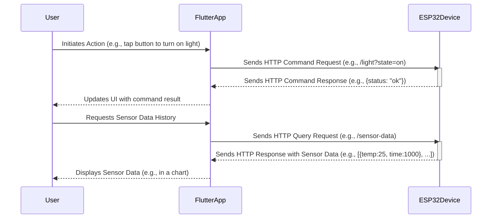

# my_yard

## Table of Contents
* [Description](#description)
* [Communication Flow](#communication-flow)
* [Data Storage](#data-storage)
* [Other Project Documentation](#other-project-documentation)
* [Contributing](#contributing)

## Description

`my_yard` is a Flutter-based mobile application designed to interface with ESP32 micro-controllers. The primary goal of this application is to provide a user-friendly interface for controlling various smart devices and systems deployed around a yard or outdoor space.

Communication with the ESP32 devices is established over HTTP, allowing for straightforward and widely supported network interactions. Users can send commands from the app to the ESP32s, which in turn can manage connected hardware.

### Key Features & Purpose:
*   **Remote Control:** Enables users to remotely operate ESP32-controlled systems.
*   **ESP32 Integration:** Specifically built to communicate with ESP32 devices, leveraging their capabilities for IoT projects.
*   **HTTP Communication:** Utilizes standard HTTP protocols for sending commands and receiving status updates.
*   **Yard Automation:** Aims to simplify the management of outdoor utilities and amenities, such as:
    *   Lighting: Garden lights, pathway illumination, decorative lighting.
    *   Water Management: Irrigation systems, sprinkler zones, water pumps.
    *   Access Control: Automated gates, garage doors.
    *   Pool & Spa: Pump controls, heater activation.
*   **Home Automation:** Extends control to indoor devices and systems, including:
    *   **Lighting Control:** Managing smart bulbs, switches, or LED strips connected via ESP32.
    *   **Appliance Control:** Managing smart plugs or directly interfaced appliances.
    *   **Environmental Monitoring:** Tracking indoor air quality (VOC, CO2), temperature, and humidity via ESP32 sensors. The ESP32 can store historical sensor data in an array.
    *   **Sensor Data Retrieval & Display:** The app can query the ESP32 to retrieve stored sensor data and display it to the user, for example, in charts or tables.
    *   **Fridge Monitoring:** Potentially tracking temperature, door status, or inventory if integrated with ESP32 sensors.
    *   **Shopping List Display:** Interfacing with an ESP32 connected to a small display to show shopping lists or other household information.

Essentially, if an ESP32 can be programmed to switch a relay, read a sensor, or send a signal to control a device in or around your home and yard, this application aims to provide the mobile interface to manage it.

This project serves as a practical application of Flutter for IoT device control, demonstrating how a mobile frontend can effectively manage hardware through network communication.

[Back to Top](#my_yard)

## Communication Flow

The application communicates with ESP32 devices over the local network using the HTTP protocol. The typical flow is as follows:

1.  The Flutter app (running on a mobile device) sends an HTTP request.
2.  The request travels over the local Wi-Fi network. This can be a command (e.g., turn on light) or a data query (e.g., fetch historical sensor data).
3.  The ESP32, connected to the same local network, receives the HTTP request.
4.  The ESP32 processes the request. This could involve toggling a relay, reading a current sensor value, or retrieving stored historical data from its internal array.
5.  The ESP32 sends an HTTP response back to the app. This response will contain status information (e.g., command success/failure) or the requested data (e.g., current sensor reading or an array of historical data points).

[Back to Top](#my_yard)

## Data Storage

Sensor readings and relevant event data are primarily stored directly on the ESP32 micro-controller. This approach allows each ESP32 device to maintain its own operational history. 

* On-Device Storage: The ESP32 utilizes its available memory (e.g., SPIFFS or LittleFS on flash, or RAM for temporary buffers) to store data.
* JSON Format: Data is typically stored in a JSON format on the ESP32. This allows for structured and easily parsable data.
* Historical Data Retrieval: When the Flutter application needs to display historical data (e.g., sensor trends over time), it sends a specific query request to the relevant ESP32. The ESP32 then retrieves the data from its local storage and sends it back to the application, usually as a JSON response.
* Storage Duration: The duration for which historical data can be stored on an ESP32 (e.g., a week, a month, or longer) is dependent on several factors:

    * The amount of available memory on the specific ESP32 model.
    * The frequency of data logging (e.g., every minute, every 5 minutes, hourly).
    * The size of each data record.
    * The number of different sensors or data points being logged.
    * Implementations may use strategies like circular buffers or data aggregation to manage storage within the ESP32's memory constraints.

[Back to Top](#my_yard)

## Other Project Documentation

This section provides links to other relevant README files within the `my_yard` project, offering more detailed information on specific components or aspects.

*   **My Appliance Project (#my_yard/my_appliance/README.md):**
    *   Details the hardware components used for controlling an appliance, including the ESP32 micro-controller, power source (solar panel, solar charge controller, battery), 3D printed enclosure, and a relay.

[Back to Top](#my_yard)

## Contributing

We welcome contributions to `my_yard`! Whether it's reporting a bug, submitting a fix, or proposing a new feature, your help is appreciated.

### Reporting Bugs
1.  **Check Existing Issues:** Before submitting a new bug, please check the existing issues on our issue tracker (e.g., GitHub Issues) to see if the bug has already been reported.
2.  **Provide Details:** If the bug hasn't been reported, please open a new issue. Include the following details:
    *   A clear and descriptive title.
    *   Steps to reproduce the bug.
    *   What you expected to happen.
    *   What actually happened (including any error messages or screenshots).
    *   Your environment (e.g., Flutter version, device OS, app version).

### Submitting Pull Requests (PRs)
1.  **Fork the Repository:** Fork the project repository to your own account.
2.  **Create a Branch:** Create a new branch in your fork for your changes (e.g., `fix/button-bug` or `feature/new-sensor-display`).
3.  **Make Changes:** Implement your fix or feature.
4.  **Test Your Changes:** Ensure your changes work as expected and don't break existing functionality.
5.  **Commit Your Changes:** Write clear and concise commit messages.
6.  **Submit a Pull Request:** Push your branch to your fork and open a pull request to the main repository. Provide a clear description of your changes in the PR.

### Requesting Features
1.  **Check Existing Requests:** Look through the existing issues/feature requests to see if your idea has already been suggested.
2.  **Open an Issue:** If not, open a new issue, clearly describing the feature you'd like to see, why it would be useful, and any potential implementation ideas.

[Back to Top](#my_yard)