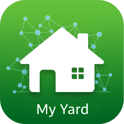
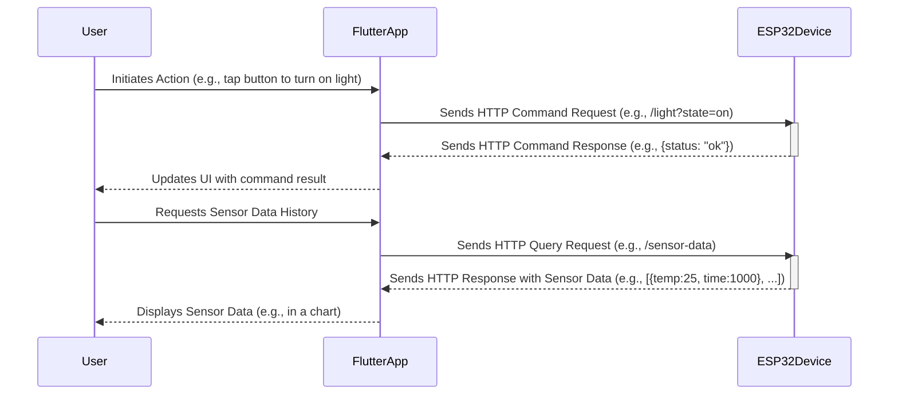

<a id="my-yard-logo-anchor"></a>





## Table of Contents
* [Description](#description)
* [Communication Flow](#communication-flow)
* [Data Storage](#data-storage)
* [Other Project Documentation](#other-project-documentation)
* [AI assisted coding](#ai-assisted-coding)
    * [Flutter](#flutter)
    * [ESP32](#esp32)
* [Contributing](#contributing)
* [License](#license)


[My Yard](./assets/my_yard.mp4)


This project is driven by Gemini AI


## Description

`my_yard` is a Flutter-based mobile application designed to interface with ESP32 micro-controllers. The primary goal of this application is to provide a user-friendly interface for controlling various smart devices and systems deployed around a yard or outdoor space or home.

Communication with the ESP32 devices is established over HTTP, allowing for straightforward and widely supported network interactions. Users can send commands from the app to the ESP32s, which in turn can manage connected hardware.

### Key Features & Purpose:
*   **Remote Control:** Enables users to remotely operate ESP32-controlled systems.
*   **ESP32 Integration:** Specifically built to communicate with ESP32 devices, leveraging their capabilities for IoT projects.
*   **HTTP Communication:** Utilizes standard HTTP protocols for sending commands and receiving status updates.
*   **Yard Automation:** Aims to simplify the management of outdoor utilities and amenities, such as:
    *   Lighting: Garden lights, pathway illumination, decorative lighting.
    *   Water Management: Irrigation systems, sprinkler zones, water pumps.
    *   Access Control: Automated gates, garage doors.
    *   Pool & Spa: Pump controls, heater activation.
*   **Home Automation:** Extends control to indoor devices and systems, including:
    *   **Lighting Control:** Managing smart bulbs, switches, or LED strips connected via ESP32.
    *   **Appliance Control:** Managing smart plugs or directly interfaced appliances.
    *   **Environmental Monitoring:** Tracking indoor air quality (VOC, CO2), temperature, and humidity via ESP32 sensors. The ESP32 can store historical sensor data in an array.
    *   **Sensor Data Retrieval & Display:** The app can query the ESP32 to retrieve stored sensor data and display it to the user, for example, in charts or tables.
    *   **Fridge Monitoring:** Potentially tracking temperature, door status, or inventory if integrated with ESP32 sensors.
    *   **Shopping List Display:** Interfacing with an ESP32 connected to a small display to show shopping lists or other household information.

Essentially, if an ESP32 can be programmed to switch a relay, read a sensor, or send a signal to control a device in or around your home and yard, this application aims to provide the mobile interface to manage it.

This project serves as a practical application of Flutter for IoT device control, demonstrating how a mobile frontend can effectively manage hardware through network communication.

[Back to Top](#my-yard-logo-anchor)


## Communication Flow

The application communicates with ESP32 devices over the local network using the HTTP protocol. The typical flow is as follows:

1.  The Flutter app (running on a mobile device) sends an HTTP request.
2.  The request travels over the local Wi-Fi network. This can be a command (e.g., turn on light) or a data query (e.g., fetch historical sensor data).
3.  The ESP32, connected to the same local network, receives the HTTP request.
4.  The ESP32 processes the request. This could involve toggling a relay, reading a current sensor value, or retrieving stored historical data from its internal array.
5.  The ESP32 sends an HTTP response back to the app. This response will contain status information (e.g., command success/failure) or the requested data (e.g., current sensor reading or an array of historical data points).




[Back to Top](#my-yard-logo-anchor)


## Data Storage

Sensor readings and relevant event data are primarily stored directly on the ESP32 micro-controller. This approach allows each ESP32 device to maintain its own operational history. 

* On-Device Storage: The ESP32 utilizes its available memory (e.g., SPIFFS or LittleFS on flash, or RAM for temporary buffers) to store data.
* JSON Format: Data is typically stored in a JSON format on the ESP32. This allows for structured and easily parsable data.
* Historical Data Retrieval: When the Flutter application needs to display historical data (e.g., sensor trends over time), it sends a specific query request to the relevant ESP32. The ESP32 then retrieves the data from its local storage and sends it back to the application, usually as a JSON response.
* Storage Duration: The duration for which historical data can be stored on an ESP32 (e.g., a week, a month, or longer) is dependent on several factors:

    * The amount of available memory on the specific ESP32 model.
    * The frequency of data logging (e.g., every minute, every 5 minutes, hourly).
    * The size of each data record.
    * The number of different sensors or data points being logged.
    * Implementations may use strategies like circular buffers or data aggregation to manage storage within the ESP32's memory constraints.

[Back to Top](#my-yard-logo-anchor)


## Other Project Documentation

This section provides links to other relevant README files within the `my_yard` project, offering more detailed information on specific components or aspects.

*   **[My Appliance Project:](my_appliance/README.md)**
    *   Details the hardware components used for controlling an appliance, including the ESP32 micro-controller, power source (solar panel, solar charge controller, battery), 3D printed enclosure, and a relay.

*   **[My Auto Gate & Garage Door Project:](my_auto_gate_and_garage_door/README.md)**
    *   Documentation for the `my_auto_gate_and_garage_door` sub-project, likely covering hardware setup and control logic for automating gates and garage doors.

*   **[My Fish Tank Project:](my_fish_tank/README.md)**
    *   Documents the `my_fish_tank` sub-project, detailing its hardware components (ESP32, various sensors, actuators for fish tank automation) and the JSON payload structures used for communication between the app and the ESP32.


*   **[My Fridge Project:](my_fridge/README.md)**
    *   Details for the `my_fridge` sub-project, potentially involving temperature monitoring, smart features, or inventory tracking for a refrigerator using an ESP32.

*   **[My Go Mole Project:](my_go_mole/README.md)**
    *   Information regarding the `my_go_mole` sub-project. This could be a game, a pest deterrent system, or another interactive project involving an ESP32.

*   **[My Got You Mouse Project:](my_got_you_mouse/README.md)**
    *   Documentation for the `my_got_you_mouse` sub-project, possibly related to a smart mouse trap, a tracking system, or an interactive game controlled by an ESP32

*   **[My Irrigation Project:](my_irrigation/README.md)**
    *   Covers the `my_irrigation` sub-project, likely detailing the hardware and software setup for an automated plant or garden irrigation system managed by an ESP32.

*   **[My Lights Project:](my_lights/README.md)**
    *   Documentation for the `my_lights` sub-project, focusing on the control of various lighting systems (e.g., indoor, outdoor, decorative) via an ESP32.

*   **[My Shopping List Project:](my_shopping_list/README.md)**
    *   Details for the `my_shopping_list` sub-project, which could involve an ESP32 interfacing with a small display to show shopping lists or other household information, potentially with app synchronization.

[Back to Top](#my-yard-logo-anchor)

## AI assisted coding

We are using Gemini AI to assist with our coding. for this wed need a set of rules for AI to follow.

### Flutter

#### 1. Project Setup & Structure

Use Flutter 3.27.2 and Dart 3.6.1

1.1 Standard Initialization: Always start new projects using the official `flutter create <project_name>`

1.2 Directory Organization:
    *  Always `lib` directory for Dart code.
    *   Within `lib`, directory organization will be done by layers (e.g., `lib/src/widgets/`, `lib/src/models/`, `lib/src/services/`).
    *   Assets will be placed in a top-level `assets` directory and declared in `pubspec.yaml`. Specific asset types will be organized into subdirectories: `assets/images/` for images, `assets/fonts/` for fonts, and other types in their respective named subdirectories (e.g., `assets/data/` for data files, `assets/rive/` for Rive animations).
    *   Tests will reside in the `test` directory.

1.3 Naming Conventions:
    *   File names will be in `snake_case.dart` (e.g., `user_profile_screen.dart`).
    *   Directories will also be in `snake_case`.
    *   Class names, enums, and typedefs will be in `UpperCamelCase`.
    *   Variables, methods, and parameters will be in `lowerCamelCase`.
    *   Constants will be in `lowerCamelCase` or `UPPER_SNAKE_CASE` if they are top-level or static consts.

#### 2. Coding Standards & Style
Effective Dart: I will adhere to the guidelines outlined in Effective Dart.

2.1 Linting: I'll use `flutter analyze` and strive to eliminate all warnings and errors. I'll assume a standard set of linting rules (e.g., from the `lints` or `flutter_lints` package).

2.2 Formatting: All Dart code will be formatted using `dart format` to ensure consistent styling.

2.3 Readability:
    *   I'll use meaningful names for variables, functions, and classes.
    *   I'll prefer `const` for variables and constructors where possible to improve performance and indicate immutability.
    *   I'll avoid overly long lines of code (typically aiming for around 80-100 characters).
    *   Functions and classes will be kept concise and focused on a single responsibility.

2.4 Type Safety: I will leverage Dart's strong type system by specifying types for variables, parameters, and return values. I'll use `dynamic` sparingly and only when necessary.


#### 3. Widget Design & Composition

3.1 Modularity: I'll break down complex UIs into smaller, reusable widgets. Each widget will have a clear purpose.

3.2 Stateless vs. Stateful:
    *   I'll prefer `StatelessWidget` whenever a widget doesn't need to manage internal, mutable state.
    *   `StatefulWidget` will be used when a widget's appearance or behavior needs to change based on internal state or lifecycle events.

3.3 `const` Constructors: For widgets that can be constant, I will provide `const` constructors. This is crucial.

3.4 Separation of Concerns**: I'll strive to keep UI (widget) code separate from business logic.

3.5 Responsive Design: I'll consider how UIs should adapt to different screen sizes and orientations, using techniques like `MediaQuery`, `LayoutBuilder`, `FittedBox`, or responsive layout widgets. I will keep `MediaQuery` to the absolute minimum, and it will be kept as close to where it is needed in the widget tree.

3.5 Build Method Purity: Widget `build` methods should be pure and free of side effects. They should describe the UI based on the current state and props.

3.6 User Preferences & Accessibility Settings: I will strive to build UIs that respect and adapt to user-defined preferences (e.g., theme choices, font sizes) and accessibility settings configured on their device (e.g., screen reader compatibility, larger text).

3.7 Widget Sourcing & Preferences: Preference will be given to Flutter's built-in widgets. In cases where I need widgets from `pub.dev`, the frequency of updates and whether the package is well-maintained will be considered first. For charts, preference will be given to the nimble_charts package.


#### 4. Theming
A consistent visual appearance enhances the user experience.

4.1 Centralized Theme: Define app-wide themes (`ThemeData` in .../src/constants/themes.dart) centrally in `MaterialApp`, including `ColorScheme`(.../src/constants/colors.dart), `Text Styles` and 'Label Sizes'(....../src/constants/text_styles.dart)

4.2 Contextual Access: Always access theme properties via `Theme.of(context)` (e.g., `Theme.of(context).colorScheme.primary`) instead of hardcoding values.

4.3 Color Palette Strategy:
    *   **Brand Alignment**: The color palette should align with the brand identity, using primary and secondary brand colors effectively.
    *   **Proactive Inquiry**: If a specific color palette or seed color is not provided by you, I will ask clarifying questions to help define it. This includes inquiring about primary/secondary brand colors, desired mood (e.g., vibrant, muted, professional), and any specific accessibility contrast requirements you might have.
    *   **ColorScheme Usage**: Utilize `ColorScheme.fromSeed` for generating harmonious light and dark color schemes from a single seed color. For more granular control, define `ColorScheme` properties explicitly.
    *   **Semantic Colors**: Consistently use semantic colors provided by `ColorScheme` (e.g., `primary`, `secondary`, `surface`, `background`, `error`, `onPrimary`, `onSecondary`, etc.) for UI elements and states.
    *   **Contrast & Harmony**: Employ color theory principles and tools (e.g., Adobe Color, Colors) to ensure the palette is visually harmonious. Crucially, verify that color combinations provide sufficient contrast for readability and meet accessibility standards (e.g., WCAG AA or AAA levels).
    *   **Limited Palette**: Prefer a limited and well-defined color palette (e.g., 3-5 primary/accent colors plus neutrals) to maintain visual consistency and avoid overwhelming the user.

4.4 Dark Mode & Theme Selection:
    *   Implement dark mode support by providing both `theme` (for light mode) and `darkTheme` in `MaterialApp`.
    *   The app should allow users to select their preferred theme mode (e.g., Light, Dark, or System default) through a clear user interface element (like a toggle in settings).
    *   The user's theme preference should be persisted across app sessions (e.g., using `shared_preferences`).
    *   Manage the active `ThemeMode` and theme switching logic through a dedicated service or state management solution (e.g., a `ThemeManager` class using `ChangeNotifier`).

4.5 Custom Extensions: For app-specific styling that doesn't fit neatly into standard `ThemeData` properties (e.g., custom button styles, specific spacing values), use `ThemeExtension<T>` for better organization and type-safe access.

4.6 Consistency: Apply all theming elements (colors, typography, component styles, spacing) consistently across the entire application to create a cohesive user experience.

4.7 Accessibility (Reiteration): Beyond color contrast, ensure that typography choices (font family, size, weight) are legible and that theme changes do not negatively impact other accessibility features.

4.8 `Color.withOpacity()` is Deprecated: As of Flutter 3.19, `Color.withOpacity()` is deprecated due to potential precision issues and the availability of clearer alternatives. Prefer using `existingColor.withAlpha((newOpacity * 255).round())` to modify an existing color's opacity, or `Color.alphaBlend(foregroundColor, backgroundColor)` for blending. If creating a new color with specific RGBA values (conceptually similar to setting all ".withValues()"), use `Color.fromARGB(alpha, red, green, blue)` or `Color.fromRGBO(red, green, blue, newOpacity)` for precise control.

#### 5. State Management
Riverpod will be the exclusive state management solution. These rules are based on Riverpod 2.6.1+ and its best practices, including the use of `riverpod_generator`.
'import 'package:riverpod/riverpod.dart';'

5.1 Core Principles & Setup:
    *   **Compile-Safety**: Prioritize code structures that allow Riverpod to catch errors at compile-time. This is greatly aided by `riverpod_generator`.
    *   **Immutability**: For state managed by Notifiers, always treat state as immutable. Updates should produce new state instances.
        Example (State Class):
        ```dart
        // In your state class
        class CounterState {
          final int count;
          CounterState(this.count);

          CounterState copyWith({int? count}) {
            return CounterState(count ?? this.count);
          }
        }
        ```
    *   **Decoupling**: Keep UI widgets separate from business logic. Providers should encapsulate business logic or state, and widgets should consume them.
    *   **ProviderScope**: Ensure the root of your application is wrapped with `ProviderScope`.
        ```dart
        void main() {
          runApp(
            ProviderScope(
              child: MyApp(),
            ),
          );
        }
        ```

5.2 Provider Selection and Granularity (with `riverpod_generator`):
    *   **Utilize `riverpod_generator`**: Strongly recommend using `riverpod_generator` and the `@riverpod` or `@Riverpod(keepAlive: ..., dependencies: ...)` annotations. This significantly reduces boilerplate and improves type safety.
        Example (Simple Provider):
        ```dart
        // lib/src/features/auth/application/auth_service.dart
        import 'package:riverpod_annotation/riverpod_annotation.dart';
        part 'auth_service.g.dart'; // Generated file

        class AuthService {
          Future<String?> signIn(String email, String password) async { /* ... */ return null; }
        }

        @riverpod // Creates authServiceProvider
        AuthService authService(AuthServiceRef ref) {
          return AuthService();
        }
        ```
    *   **Appropriate Provider Type (Implicit with Generator)**: The generator often infers the best provider type.
        *   `@riverpod` on a function returning a value: `Provider` or `FutureProvider` (if async).
        *   `@riverpod` on a class extending `Notifier`: `NotifierProvider`.
        *   `@riverpod` on a class extending `AsyncNotifier`: `AsyncNotifierProvider`.
        *   `@riverpod` on a class extending `StreamNotifier`: `StreamNotifierProvider`.
    *   **Granularity**: Create small, focused providers. Each provider should manage a single piece of state or a specific service/repository.
        Example (Notifier for a counter):
        ```dart
        // lib/src/features/counter/application/counter_notifier.dart
        import 'package:riverpod_annotation/riverpod_annotation.dart';
        part 'counter_notifier.g.dart';

        @riverpod // Creates counterProvider
        class Counter extends _$Counter { // Generator creates _$Counter
          @override
          int build() => 0; // Initial state

          void increment() => state++;
          void decrement() => state--;
        }
        ```

5.3 Provider Interaction in UI (Widgets):
    *   **`ConsumerWidget` or `HookConsumerWidget`**: Widgets that need to listen to providers should extend `ConsumerWidget` (or `HookConsumerWidget` if using `flutter_hooks`).
    *   **`ref.watch`**: Use in widget `build` methods to reactively listen to a provider's state. The widget will rebuild when the watched state changes.
        ```dart
        class CounterText extends ConsumerWidget {
          @override
          Widget build(BuildContext context, WidgetRef ref) {
            final count = ref.watch(counterProvider); // Assuming counterProvider from above
            return Text('Count: $count');
          }
        }
        ```
    *   **`ref.read`**: Use for one-time reads of a provider's state, typically within event handlers (e.g., `onPressed`).
        ```dart
        ElevatedButton(
          onPressed: () {
            ref.read(counterProvider.notifier).increment();
          },
          child: Text('Increment'),
        )
        ```
    *   **`ref.listen`**: Use to perform side-effects in response to state changes (e.g., showing a SnackBar, navigating).
        ```dart
        ref.listen<AsyncValue<String?>>(authServiceProvider.select((s) => s.user), (previous, next) {
          if (next is AsyncError) {
            ScaffoldMessenger.of(context).showSnackBar(SnackBar(content: Text(next.error.toString())));
          }
        });
        ```

5.4 Provider Interaction (Provider-to-Provider):
    *   Providers can depend on other providers using `ref.watch` or `ref.read` within their `build` method (for generated providers) or creation function.
        Example (A provider depending on AuthService):
        ```dart
        // lib/src/features/user/application/user_repository.dart
        import 'package:riverpod_annotation/riverpod_annotation.dart';
        import '../auth/auth_service.dart'; // Assuming auth_service.dart
        part 'user_repository.g.dart';

        class UserRepository {
          UserRepository(this._authService);
          final AuthService _authService;
          // ... methods to fetch user data using _authService token
        }

        @riverpod
        UserRepository userRepository(UserRepositoryRef ref) {
          final authService = ref.watch(authServiceProvider);
          return UserRepository(authService);
        }
        ```

5.5 Provider Modifiers (with `riverpod_generator`):
    *   **`.autoDispose` (default with generator unless `keepAlive = true`)**: State is disposed of when no longer listened to. Control with `@Riverpod(keepAlive: true)` if needed.
    *   **`.family` (achieved by passing arguments to generated providers)**: For parameterized providers.
        Example (Family Provider):
        ```dart
        // lib/src/features/todos/application/todo_list_provider.dart
        import 'package:riverpod_annotation/riverpod_annotation.dart';
        part 'todo_list_provider.g.dart';

        class Todo { /* ... */ }

        @riverpod
        Future<Todo> todoItem(TodoItemRef ref, int todoId) async {
          // Fetch todo item by id
          return Todo(/* ... */);
        }
        // Usage in widget: ref.watch(todoItemProvider(someId))
        ```

5.6 Asynchronous State Handling:
    *   **`AsyncValue<T>`**: When working with providers that return `Future` or `Stream` (e.g., `AsyncNotifierProvider`, or `@riverpod` functions returning `Future`), the state will be `AsyncValue<T>`.
    *   **`AsyncValue.when()`**: Use this in the UI to gracefully handle `data`, `loading`, and `error` states.
        ```dart
        class UserProfileWidget extends ConsumerWidget {
          final String userId;
          UserProfileWidget({required this.userId});

          @override
          Widget build(BuildContext context, WidgetRef ref) {
            // Assuming an asyncUserProvider(userId) that fetches user data
            final userAsync = ref.watch(asyncUserProvider(userId));
            return userAsync.when(
              data: (user) => Text('User: ${user.name}'),
              loading: () => CircularProgressIndicator(),
              error: (err, stack) => Text('Error: $err'),
            );
          }
        }
        ```
    *   **`skipLoadingOnRefresh/Reload`**: Consider using `AsyncValue.copyWithPrevious` or `skipLoadingOnRefresh`/`skipLoadingOnReload` properties of `when` for a better UX during data re-fetches.
        ```dart
        // Inside when:
        // loading: () => userAsync.hasValue ? Text('Updating: ${userAsync.value!.name}') : CircularProgressIndicator(),
        // or
        // return userAsync.when(
        //   skipLoadingOnRefresh: true, // Keeps showing old data while refreshing
        //   data: (user) => Text('User: ${user.name}'),
        //   loading: () => CircularProgressIndicator(),
        //   error: (err, stack) => Text('Error: $err'),
        // );
        ```

5.7 Testing:
    *   **Unit Test Providers**: Test providers in isolation using `ProviderContainer`.
        ```dart
        test('CounterNotifier increments state', () {
          final container = ProviderContainer();
          addTearDown(container.dispose); // Ensure disposal

          final notifier = container.read(counterProvider.notifier);
          expect(container.read(counterProvider), 0);
          notifier.increment();
          expect(container.read(counterProvider), 1);
        });
        ```
    *   **Override Dependencies**: Use `ProviderContainer(overrides: [...])` or `ProviderScope(overrides: [...])` for testing.
        ```dart
        // In a test
        final mockAuthService = MockAuthService(); // Using a mock class
        when(mockAuthService.signIn(any, any)).thenAnswer((_) async => 'mock_user_id');

        final container = ProviderContainer(
          overrides: [
            authServiceProvider.overrideWithValue(mockAuthService),
          ],
        );
        // Now, any provider reading authServiceProvider will get the mock.
        ```

5.8 Naming Conventions:
    *   Generated providers are typically `lowerCamelCaseProvider` (e.g., `authServiceProvider`, `counterProvider`).
    *   Notifier classes are `UpperCamelCase` (e.g., `Counter`, `AuthNotifier`).

5.9 Best Practices & Common Pitfalls:
    *   **Avoid `ref` in constructors**: Do not pass `ref` to regular class constructors. Dependencies should be passed explicitly or obtained via `ref` within provider build methods.
    *   **Side Effects**: Perform side effects (API calls, database writes) within Notifier methods or by using `ref.listen` or `ref.read` in callbacks, not directly in provider `build` methods if the provider is meant to return synchronous state.
    *   **Read vs Watch**: Be mindful of when to use `ref.read` (for one-time actions) versus `ref.watch` (to rebuild on changes). Incorrect usage can lead to missed UI updates or unnecessary rebuilds.
    *   **Keep UI Dumb**: Widgets should primarily be responsible for displaying state and dispatching user events to notifiers/providers.
    *   **Error Handling**: Properly handle errors in asynchronous providers and display them gracefully in the UI using `AsyncValue.when` or `try-catch` within Notifier methods.
    *   **Dependencies in `@Riverpod`**: Use `@Riverpod(dependencies: [otherProvider])` to explicitly declare dependencies for generated providers. This helps Riverpod optimize and can be useful for tools or analysis.

5.10 Code Generation:
    *   Always run the build runner after creating or modifying providers annotated with `@riverpod`:
        `flutter pub run build_runner watch --delete-conflicting-outputs` (for continuous watching)
        or
        `flutter pub run build_runner build --delete-conflicting-outputs` (for a one-time build).


#### 6. Asynchronous Operations & Error Handling
Handling operations that take time, and dealing with potential errors, is crucial.

6.1 `async/await`: I'll use `async` and `await` for clear and readable asynchronous code.

6.2 Futures and Streams: I'll use `FutureBuilder` and `StreamBuilder` appropriately to reactively build UI based on the state of asynchronous operations.

6.3 Loading States: I'll ensure UIs provide feedback during asynchronous operations (e.g., loading indicators).

6.4 Error Handling:
    *   I'll use `try-catch` blocks to handle potential exceptions in asynchronous code.
    *   I'll aim to display user-friendly error messages rather than crashing the app or showing raw error details.
    *   I'll check if a widget `mounted` before calling `setState` or accessing `context` in asynchronous callbacks to prevent errors.

#### 7. HTTP Calls & API Interaction
Interacting with external services and APIs is a common requirement.

7.1 Dedicated Service Layer:
    *   All HTTP calls and API interactions will be encapsulated within a dedicated service layer (e.g., `services/api_service.dart` or `services/github_service.dart`).
    *   UI widgets will not make HTTP calls directly but will interact with the service layer.

7.2 `http` Package:
    *   The `http` package (`package:http/http.dart`) will be the standard choice for making HTTP requests.

7.3 Generic Request Handler:
    *   Services should implement a generic, private helper method for common request types (e.g., `_getRequest(String endpoint)`, `_postRequest(String endpoint, Map<String, dynamic> body)`).
    *   This helper method will handle base URL concatenation, common headers, and basic response parsing/error checking.

7.4 Specific API Methods:
    *   For each distinct API endpoint or operation, the service will expose a public method (e.g., `Future<UserProfile> fetchUserProfile(String userId)`).
    *   These methods will call the generic request handler and perform any specific data transformation or error handling relevant to that endpoint.

7.5 Error Handling (Service Layer):
    *   Services will robustly handle potential errors: check HTTP status codes and throw specific exceptions for non-successful responses (e.g., `ApiException('Failed to load data (Status code: \${response.statusCode})')`). Use `try-catch` blocks for network errors.
    *   Exceptions thrown by the service should be caught and handled gracefully in the calling layer (e.g., UI or state management).

7.6 Constants for URLs: Base URLs and frequently used API path segments should be defined as constants (e.g., in an `app_constants.dart` file or within the service) to avoid magic strings.

7.6 Data Models: JSON responses from APIs should be parsed into strongly-typed Dart model classes (with `fromJson` factory constructors) to ensure type safety.

8. Navigation
Getting around the app should be intuitive.

8.1 Routing Strategy & Package: 'import 'package:go_router/go_router.dart';'
    *   Navigation will be performed using `go_router`'s context-based methods like `context.go('/path')`, `context.push('/path')`, or `context.goNamed('routeName')`.
    *   All routes will be defined within the `GoRouter` configuration.

8.2 Route Arguments: I'll pass arguments to routes in a type-safe manner using `go_router`'s mechanisms, often by defining argument classes passed via the `extra` parameter or through path/query parameters.
    *   Example (using `extra`): `context.go('/user_details', extra: UserDetailsArgs(userId: '123'));`
    *   Example (using path parameters defined in `GoRoute`): `context.go('/users/123');`

#### 9. Dependencies & Packages
I'll leverage the rich Flutter ecosystem responsibly.

9.1 Judicious Use: I'll only add packages from `pub.dev` when they provide significant value and are well-maintained.

9.2 Version Pinning: I'll specify dependency versions in `pubspec.yaml` carefully, often using caret syntax (e.g., `^1.2.3`) to allow compatible updates while ensuring stability.

9.3 Up-to-Date: I'll try to use recent, stable versions of packages.

9.4 Cleanup: I'll remind you or attempt to remove unused dependencies to keep the project lean.

9.5 CLI Command for Adding Packages: When I suggest adding a new package, I will also provide the corresponding `flutter pub add <package_name>` command for easy installation.

#### 10. Testing

10.2 Widget Tests:
    *   I'll write widget tests to verify that widgets render correctly and respond to user interactions as expected.
    *   I'll use the `flutter_test` package.

10.3 Integration Tests: For more complex flows, I might suggest or provide integration tests.

10.4 Test Coverage: I'll aim for reasonable test coverage, focusing on critical paths and complex logic.

10.5 Mocking: I'll use mocking (e.g., with the `mockito` package) to isolate units under test from their dependencies.

#### 11. Performance
A smooth and responsive app is a joy to use.

11.1 Widget Rebuilds: I'll be mindful of minimizing unnecessary widget rebuilds. This includes:
    *   Using `const` widgets wherever possible.
    *   Breaking down large widgets.
    *   Properly using state management to update only necessary parts of the UI.

11.2 `ListView.builder`: For long lists, I'll always use `ListView.builder` (or similar constructors like `GridView.builder`) for performance.

11.3 Lazy Loading: I'll implement lazy loading for data and resources where appropriate.

11.4 DevTools: I'll encourage the use of Flutter DevTools for profiling and identifying performance bottlenecks.

11.5 Avoid Expensive Operations in Build: I'll avoid performing expensive computations or I/O operations directly within `build` methods.

#### 12. Code Documentation & Comments
Code should be understandable not just by machines, but by humans too!

12.1 Dartdocs: I'll write Dartdocs comments (`///`) for all public classes, methods, functions, and important properties. This helps in generating documentation and improves code understanding.
    *   Example:
        ```dart
        /// Fetches user data from the server.
        ///
        /// Throws a [NetworkException] if the request fails.
        Future<User> fetchUserData(String userId) async {
          // ... implementation ...
        }
        ```

12.2 Inline Comments: I'll use inline comments (`//`) to explain complex, non-obvious, or tricky parts of the code.

12.3 Clarity over Quantity: Comments will be used to clarify *why* something is done, not just *what* is done (if the code itself is clear).

12.4 Keep Updated: I'll try to ensure comments and documentation are kept in sync with code changes.

#### 13. Security Considerations
Building secure apps is a top priority.

13.1 Sensitive Data: I will avoid hardcoding sensitive information (API keys, secrets) directly in the client-side code. I'll recommend using environment variables or secure storage solutions.

13.2 Network Communication: I'll default to using HTTPS for all network requests.

13.3 Input Validation: I'll implement input validation on both client-side and server-side (though I primarily generate client-side code).

13.4 Dependency Security: I'll be mindful of potential vulnerabilities in third-party packages.

13.5 Local Storage: When using local storage (e.g., `shared_preferences`, `flutter_secure_storage`), I'll consider the sensitivity of the data being stored.

#### 14. User Experience (UX) Focus
While I generate code, I'll keep the end-user experience in mind.

14.1 Feedback: I'll ensure the app provides appropriate feedback for user actions (e.g., taps, loading states, success/error messages).

14.2 Accessibility (A11y): I'll try to use widgets and practices that support accessibility, such as providing semantic labels and ensuring sufficient contrast (though visual design is often iterative).

14.3 Platform Conventions: I'll aim to follow common UI/UX patterns for iOS and Android where appropriate, or create a consistent custom design.

14.4 Intuitive Interfaces: I'll strive to generate UIs that are intuitive and easy to navigate.

#### 15. Version Control Practices
Good version control hygiene is important for collaboration and project history. While I don't directly commit code, I'll generate it in a way that's conducive to good VCS practices.

15.1 `.gitignore`: I'll assume a standard Flutter `.gitignore` file is in use to exclude unnecessary files from version control.

15.2 Logical Changes: When I make changes or add features, I'll try to do so in logical, self-contained chunks that would correspond to good commit practices.

#### 16. Continuous Improvement

The Flutter ecosystem is always evolving, and so am I!

16.1 Stay Updated: I'll be continuously updated with the latest Flutter features, Dart language enhancements, and community best practices.

16.2 Adaptability: I'll be open to adapting these guidelines based on new information, specific project requirements, or your feedback.

#### 17. UI Constants & Theme Helpers

To ensure visual consistency for spacing, padding, border radii, and other common UI values, and to make them easily updatable.

17.1 Standard UI Constants File: The file lib/src/constants/ui_constants.dart will always be added to new projects and used as a primary source for UI constants.

17.2 Dedicated Constants File:
    *   I will create or use a dedicated file for UI constants, for example, `lib/src/constants/ui_constants.dart` or `lib/src/common/ui_helpers.dart`.

17.3 Standard Spacing & Padding:
    *   Define standard spacing values as `double` constants (e.g., `kSpaceSmall = 4.0`, `kSpaceMedium = 8.0`, `kSpaceLarge = 16.0`).
    *   Define standard padding `EdgeInsets` constants (e.g., `kPagePadding = EdgeInsets.all(16.0)`, `kHorizontalPaddingMedium = EdgeInsets.symmetric(horizontal: 8.0)`).
    *   These constants should be used throughout the application for `Padding` widgets, `SizedBox` dimensions, margins in `Container`s, etc., instead of magic numbers.

17.4 Standard Border Radius:
    *   Define standard `BorderRadius` constants (e.g., `kBorderRadiusSmall = BorderRadius.circular(4.0)`, `kCardBorderRadius = BorderRadius.circular(12.0)`).

17.5 Reusable `SizedBox` Widgets (Theme Helpers):
    *   Consider creating `const SizedBox` instances for common fixed-size spacing (e.g., `const SizedBox kVerticalSpacerSmall = SizedBox(height: kSpaceSmall);`, `const SizedBox kHorizontalSpacerMedium = SizedBox(width: kSpaceMedium);`). These can make widget trees more readable.

17.6 Other UI Constants:
    *   This file can also be a home for other frequently used UI values like standard icon sizes (`kIconSizeSmall`, `kIconSizeMedium`), button heights (`kButtonHeight`), card elevations (`kCardElevationDefault`), or animation durations (`kShortAnimationDuration`).

17.7 Naming Conventions:
    *   Constants should follow clear naming conventions, often prefixed with `k` (e.g., `kPagePadding`) or be descriptive (e.g., `smallSpace`).

17.8 Usage:
    *   I will consistently import and use these constants in widget build methods to maintain uniformity across the app.

[Back to Top](#my-yard-logo-anchor)


### ESP32

This guide outlines best practices for developing firmware on Arduino-compatible platforms, with a special focus on the ESP32.

#### 1. Project Setup & Structure

*   **Recommended IDE**: **PlatformIO with Visual Studio Code** is the standard for any project beyond a simple sketch.
*   **Directory Structure (PlatformIO)**:
    *   `src/`: Primary source code (`.cpp`, `.h`).
    *   `lib/`: Custom or third-party libraries.
    *   `include/`: Project-wide header files.
    *   `data/`: Files for the device's filesystem (SPIFFS/LittleFS).
    *   `platformio.ini`: Core configuration for board, framework, and libraries.

#### 2. Coding Standards & Style

*   **Naming Conventions**:
    *   Variables & Functions: `lowerCamelCase` (e.g., `ledState`, `connectToWifi()`).
    *   Constants & Macros: `UPPER_SNAKE_CASE` (e.g., `const int LED_PIN = 2;`).
    *   Classes & Structs: `UpperCamelCase` (e.g., `class DeviceConfig {};`).
*   **Formatting**: Use `clang-format` for automatic code formatting.
*   **Readability**:
    *   Avoid magic numbers. Use named constants instead (e.g., `const int STATUS_LED_PIN = 13;`).
    *   Use `const` for variables that do not change.

#### 3. Memory Management

*   **Avoid `String` Object**: Prefer C-style strings (`char` arrays) and safe functions like `snprintf()` to prevent heap fragmentation.
*   **Minimize Dynamic Allocation**: Avoid `new` or `malloc` in the main `loop()`. Allocate memory once in `setup()` if necessary.
*   **Use `PROGMEM`**: Store large, read-only data (like HTML/JSON templates) in Flash memory to save RAM.

#### 4. Asynchronous Operations

*   **No `delay()`**: Never use `delay()` as it blocks all execution.
*   **Use `millis()`**: Always use the "Blink Without Delay" pattern with `millis()` for non-blocking time-based events.
*   **State Machines**: Use simple state machines for managing complex sequences to keep the `loop()` clean.
*   **ESP32 FreeRTOS**: For complex applications, leverage FreeRTOS by creating separate tasks for different concerns (e.g., web server, sensor reading).

#### 5. Networking & Data

*   **WiFi Management**: Implement a robust, non-blocking WiFi manager with a fallback to Access Point (AP) mode for configuration.
*   **JSON**: Use the **ArduinoJson** library. Pre-calculate `JsonDocument` size carefully using the ArduinoJson Assistant.
*   **Web Server**: On ESP32, prefer the **`ESPAsyncWebServer`** library for non-blocking performance.

#### 6. Debugging & Error Handling

*   **Serial Debugging**: Use `Serial.printf()` for formatted output. Create a debug macro to easily enable/disable logging.
*   **Watchdog Timer (WDT)**: Be aware that blocking code will cause the WDT to reset the device. This is a feature that enforces non-blocking code.

#### 7. Security

*   **Credentials**: Never hardcode credentials. Use an AP mode to configure and store them in non-volatile memory (EEPROM or LittleFS).
*   **Communication**: Use HTTPS for sensitive API calls and password-protect Over-The-Air (OTA) update endpoints.

#### 8. Documentation

*   **Comments**: Write clear comments for all non-trivial functions, explaining their purpose, parameters, and return values.

[Back to Top](#my-yard-logo-anchor)


## Contributing

We welcome contributions to `my_yard`! Whether it's reporting a bug, submitting a fix, or proposing a new feature, your help is appreciated.

### Reporting Bugs
1.  **Check Existing Issues:** Before submitting a new bug, please check the existing issues on our issue tracker (e.g., GitHub Issues) to see if the bug has already been reported.
2.  **Provide Details:** If the bug hasn't been reported, please open a new issue. Include the following details:
    *   A clear and descriptive title.
    *   Steps to reproduce the bug.
    *   What you expected to happen.
    *   What actually happened (including any error messages or screenshots).
    *   Your environment (e.g., Flutter version, device OS, app version).

### Submitting Pull Requests (PRs)
1.  **Fork the Repository:** Fork the project repository to your own account.
2.  **Create a Branch:** Create a new branch in your fork for your changes (e.g., `fix/button-bug` or `feature/new-sensor-display`).
3.  **Make Changes:** Implement your fix or feature.
4.  **Test Your Changes:** Ensure your changes work as expected and don't break existing functionality.
5.  **Commit Your Changes:** Write clear and concise commit messages.
6.  **Submit a Pull Request:** Push your branch to your fork and open a pull request to the main repository. Provide a clear description of your changes in the PR.

### Requesting Features
1.  **Check Existing Requests:** Look through the existing issues/feature requests to see if your idea has already been suggested.
2.  **Open an Issue:** If not, open a new issue, clearly describing the feature you'd like to see, why it would be useful, and any potential implementation ideas.

[Back to Top](#my-yard-logo-anchor)


## License

This project is licensed under the Mozilla Public License 2.0 (MPL-2.0) - see the [LICENSE](LICENSE) file for details.

[Back to Top](#my-yard-logo-anchor)

// Copyright (c) [2025] Johan Scheepers
// GitHub: https://github.com/JohanScheepers/My_Yard